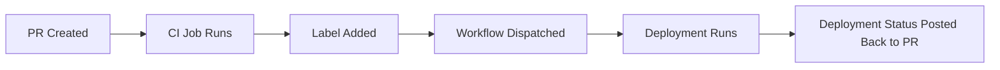

## Overview

I was talking to a colleague [@colindembovsky](https://colinsalmcorner.com/) the other day about how to report back to the PR the status of a GitHub Action workflow that was triggered programmatically via the `workflow_dispatch` event. The use case was that a workflow would be triggered when a [certain label was added to the PR](https://github.com/colindembovsky/mindaro/blob/main/.github/workflows/bikes-label-trigger.yml#L15:L16) that runs the deployment workflow via the `workflow_dispatch` event. This worked well, but the problem was that there was no way to report back to the PR the status of the deployment workflow. We could ultimately see on the PR if the deployment workflow was successful or not, but it would be nice to have a [status check](https://docs.github.com/en/pull-requests/collaborating-with-pull-requests/collaborating-on-repositories-with-code-quality-features/about-status-checks) on the PR that would show the status of the deployment workflow like we do for actions specifically triggered by the PR.

To summarize, this is the flow and challenge statement:

1. PR is created
2. CI job runs
3. A label is added to the PR, e.g.: `deploy to demo`
4. A [workflow](https://github.com/colindembovsky/mindaro/blob/main/.github/workflows/bikes-label-trigger.yml#L15:L16) that is just listening for the label event is triggered
5. The label update workflow calls the [deployment workflow](https://github.com/colindembovsky/mindaro/blob/main/.github/workflows/deploy-component.yml#L5) via the `workflow_dispatch` event
6. The label job shows up as a status check in the PR
7. The deployment job runs
8. We want to post back to the PR the status of the deployment job, but because the job wasn't created by the PR, it doesn't show up as a status check on the PR

The status checks are shown on the image below. Notice how the job to label the PR shows up here, but not the job the subsequent job queued programmatically via the `workflow_dispatch` event:

{: .shadow }
_Only the status checks associated with the pull request show up here_

Basically, what we want to happen is this:



## Checks API

But first, let's take a step back and explain what the Checks API is. We can use the [Checks API](https://docs.github.com/en/rest/checks), specifically the [create a check run API](https://docs.github.com/en/rest/checks/runs#create-a-check-run), to create a check run that will show up as a [status check](https://docs.github.com/en/pull-requests/collaborating-with-pull-requests/collaborating-on-repositories-with-code-quality-features/about-status-checks) on the PR. 

From the [docs](https://web.archive.org/web/20221230233914/https://docs.github.com/en/rest/guides/getting-started-with-the-checks-api), the Check Runs API is described as:

> The Check Runs API enables you to build GitHub Apps that run powerful checks against code changes in a repository. You can create apps that perform continuous integration, code linting, or code scanning services and provide detailed feedback on commits.
> 
> A check run is an individual test that is part of a check suite. Each run includes a status and conclusion.
>
> GitHub automatically adds new check runs to the correct check suite based on the check run's repository and SHA.
> 
> {: width="600" }{: .shadow }
_Only the status checks associated with the pull request show up here_

There's a critical keyword there: `SHA`. A check run is created on a particular SHA, and this is how we are going to link our second job back to the original PR: by using the SHA of the commit that triggered the workflow.

In the documentation, you will see Check Suites and Check Runs. A Check Suite is just a collection of Check Runs. By default, GitHub creates a check suite automatically when code is pushed to the repository. We want to create a Check Run to show up in the Check Suite that shows up as Status Checks when a PR is created.

The Checks API was introduced in May 2018. If you are interested in more of the history and other use cases of the API, follow the [link](https://github.blog/2018-05-07-introducing-checks-api/).

## Implementation

Alright, here's the good part of the article! Let me explain what type of actions we need, and some options for implementing:

1. An action to create the check:
    - I'm going to use [LouisBrunner/checks-action](https://github.com/LouisBrunner/checks-action) to create the check for us
    - We could alternatively write our own [API call](https://docs.github.com/en/rest/checks/runs#create-a-check-run) or use the 'Create a check run' [octokit](https://octokit.github.io/rest.js/v19#checks-create) method for this, but the action allows us to [import a markdown file as the summary of the check](https://github.com/LouisBrunner/checks-action/pull/24), which is quite nice
2. An action to queue the deployment workflow with the `workflow_dispatch` event. A few more options here:
    - The [benc-uk/workflow-dispatch](https://github.com/benc-uk/workflow-dispatch) action
    - The [colindembovsky/deployment-lifecycle-actions/create-deployment-from-label](https://github.com/colindembovsky/deployment-lifecycle-actions) - this action creates a deployment when a label is added to the PR
    - The [actions/github-script](https://github.com/actions/github-script) to call the 'Create a workflow dispatch event' [octokit](https://octokit.github.io/rest.js/v19#actions-create-workflow-dispatch) method
      - Since it's a pretty simple call, I am going to use this option. This is what this would look like as an action:

        
        ```yml
        - name: Trigger Workflow
          uses: actions/github-script@v6
          with:
            script: |
              github.rest.actions.createWorkflowDispatch({
                owner: context.repo.owner,
                repo: context.repo.repo,
                workflow_id: 'new-workflow.yml',
                ref: '${{ github.head_ref }}',
                inputs: {
                  "workflow-input-1": "value-1",
                  "workflow-input-2": "value-2",
                }
              })
        ```
        

We also need to decide if we are going to use a GitHub App or use provided the `GITHUB_TOKEN` to create the status check. If we use the `GITHUB_TOKEN`, it will show up as created from the actions[bot] like the other checks show up as. If we use a GitHub App, it will show up as with the GitHub App's avatar image. The `GITHUB_TOKEN` is easier, but I found out via an [issue](https://github.com/LouisBrunner/checks-action/issues/18#issuecomment-1027122151) in the [LouisBrunner/checks-action](https://github.com/LouisBrunner/checks-action) repo, that if we want to provide a custom `details_url`, we need to use a GitHub App. The `details_url` can be used to provide a custom link, such as a link to a third-party dashboard where results are uploaded. Note that unlike most things in GitHub, we CANNOT use a PAT for this.

This is how each look:

1. Using the `github_token`: 
  {: .shadow }
  _Status check created with github_token, as shown in a Pull Request_
  {: .shadow }
  _Status check created with github_token, after clicking on details - note the at the bottom, it links to the action workflow run_
2. Using a GitHub App:
  {: .shadow }
  _Status check created with github_token, as shown in a Pull Request_
  {: .shadow }
  _Status check created with github_token, after clicking on details - note the at the bottom, we can provide a custom link_

If you would like more information on how to create a GitHub App or what that even is, see my post: [Demystifying GitHub Apps: Using GitHub Apps to Replace Service Accounts](/posts/github-apps/).

You'll notice in the example above, I'm attaching my generated code coverage markdown report. See related post: [Code Coverage Reports with GitHub Actions](/posts/github-code-coverage/).

## The YML

Now, once you have decided on using a `github_token` or GitHub App, you can move on to creating the workflows. Since I'm using a GitHub App, I'm using an additional [action](https://github.com/tibdex/github-app-token) to obtain the app's installation access token.

First, we have the `.github/workflows/create-deployment.yml`{: .filepath} workflow. Note where we initialize the check run with a status of `in_progress` on line 29, trigger the `deployment.yml`{: .filepath} workflow on line 35, and if this job fails, conclude the check run with the job's failure status on line 53. We could have hardcoded the conclusion using the [options in the API](https://docs.github.com/en/rest/checks/runs#create-a-check-run), but I choose to stick with the job's status for consistency (with the condition, would be `failure`). This failure is here to ensure that if for some reason the job fails before it can even call the second workflow, we want to report a failure.


```yml
name: create deployment

on:
  push:
    branches: [ "main" ]
  pull_request:
    branches: [ "main" ]
  workflow_dispatch:
  
jobs:
  create-deployment:
    runs-on: ubuntu-latest
    steps:
    - uses: actions/checkout@v3
    
    - uses: tibdex/github-app-token@v1
      id: get_installation_token
      with: 
        app_id: 170284
        private_key: ${{ secrets.PRIVATE_KEY }}

    - uses: LouisBrunner/checks-action@v1.3.1
      id: check
      with:
        sha: ${{ github.sha }}
        token: ${{ steps.get_installation_token.outputs.token }}
        # token: ${{ github.token }}
        name: Second Job
        status: in_progress

    - name: Trigger Workflow
      uses: actions/github-script@v6
      with:
        script: |
          github.rest.actions.createWorkflowDispatch({
            owner: context.repo.owner,
            repo: context.repo.repo,
            workflow_id: 'deployment.yml',
            ref: '${{ github.head_ref }}',
            inputs: {
              "workflow-input-1": "value-1",
              "workflow-input-2": "value-2",
            }
          })

    - uses: LouisBrunner/checks-action@v1.3.1
      if: failure()
      with:
        sha: ${{ github.sha }}
        token: ${{ steps.get_installation_token.outputs.token }}
        # token: ${{ github.token }}
        name: Second Job
        conclusion: ${{ job.status }}
        details_url: https://josh-ops.com/posts/github-code-coverage/
        action_url: https://josh-ops.com/posts/github-code-coverage/
        output: |
          {"summary":""}
        output_text_description_file: code-coverage-results.md
```
{: file='.github/workflows/create-deployment.yml'}

Next, we have the `.github/workflows/create-deployment.yml`{: .filepath} workflow which is triggered via the `workflow_dispatch` event from the workflow above. Note where we always conclude the check run with the deployment job's status on line 39. If this job finishes successfully, the status will be `success`. If this job fails, the status will be `failure`.

```yml
name: deployment

on:
  workflow_dispatch:
    inputs:
      workflow-input-1:
        description: 'workflow-input-1'
        required: true
        default: ''
      workflow-input-2:
        description: 'workflow-input-2'
        required: true
        default: ''

jobs:
  build:
    runs-on: ubuntu-latest
    steps:
    - uses: actions/checkout@v3

    - uses: tibdex/github-app-token@v1
      id: get_installation_token
      with: 
        app_id: 170284
        private_key: ${{ secrets.PRIVATE_KEY }}

    - run: | 
        echo "Hello, world!"
        echo "workflow-input-1 is ${{ github.event.inputs.workflow-input-1 }}"
        echo "workflow-input-2 is ${{ github.event.inputs.workflow-input-2 }}"

    - uses: LouisBrunner/checks-action@v1.3.1
      if: always()
      with:
        sha: ${{ github.sha }}
        token: ${{ steps.get_installation_token.outputs.token }}
        # token: ${{ github.token }}
        name: Second Job
        conclusion: ${{ job.status }}
        details_url: https://josh-ops.com/posts/github-code-coverage/
        action_url: https://josh-ops.com/posts/github-code-coverage/
        output: |
          {"summary":""}
        output_text_description_file: code-coverage-results.md
```
{: file='.github/workflows/deployment.yml'}


When updating and/or concluding the check run, we just have to make sure we use the same `name` as the initial check run.

The resulting status check can be seen in the sample pull request [here](https://github.com/joshjohanning-org/PrimeService-unit-testing-using-dotnet-test/pull/11).

## Advanced Checks

We've just scratched the surface with how powerful Checks can be! The Checks API allows you to report rich details about each check run, including statuses, images, summaries, annotations, and requested actions. There is a [really great example in the GitHub docs](https://docs.github.com/en/enterprise-server@3.4/developers/apps/guides/creating-ci-tests-with-the-checks-api) demonstrating all of these features in an example app.

### Annotations

Using the [LouisBrunner/checks-action](https://github.com/LouisBrunner/checks-action#annotations), we can create an annotation that links to a particular line in the code. An example of this is how the CodeQL action reports security vulnerabilities. See the screenshot below:

{: .shadow }
_Example using Checks to create a line annotation_

### Requested Actions

You can also have your check run implement certain fixes with the click of a button using [requested actions](https://web.archive.org/web/20221230233914/https://docs.github.com/en/rest/guides/getting-started-with-the-checks-api#check-runs-and-requested-actions). An example the [docs](https://web.archive.org/web/20221230233914/https://docs.github.com/en/rest/guides/getting-started-with-the-checks-api#check-runs-and-requested-actions) gives is how a code linting app could automatically fix detected syntax errors:

{: .shadow }
_Example using Checks to create a line annotation_

## Summary

I've been aware of the Checks API, but I haven't explored much of it yet. When researching a solution for the initial problem, I found that there wasn't a ton of resources out there, so hence this blog post. The Checks API is super powerful, and allows for a lot of creativity and flexibility with how you want to stage your workflows. I hope this post helps you in your GitHub Actions journey!

Happy check-ing! ✅ ❌ 🤓
