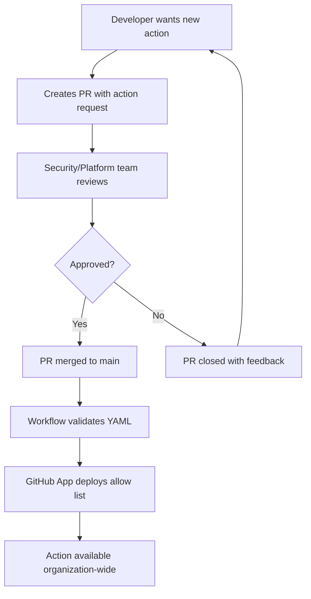

## Overview

As organizations scale and mature their use of GitHub Actions, maintaining oversight of action usage becomes increasingly important. While GitHub provides native [Actions permissions settings](https://docs.github.com/en/organizations/managing-organization-settings/disabling-or-limiting-github-actions-for-your-organization#allowing-select-actions-and-reusable-workflows-to-run), managing these through the UI can become cumbersome, error-prone, and developers have no idea which actions they're actually allowed to use.

This post explores how to implement a GitHub Actions allow list using configuration as code which is version controlled, provides self-service visibility, and has a built-in request and approval process natively through pull requests.

I'm going to be using my [actions-allow-list-as-code](https://github.com/joshjohanning-org/actions-allow-list-as-code) repository as the example implementation. This is the same repository I use to manage my own GitHub Actions allow list, so you can see it in action! 🚀

> If you're already sold on this idea and just want to get started, skip to the [TLDR / Getting Started](#tldr--getting-started) section below for the quick and dirty implementation details!
{: .prompt-tip }

## Why Configuration as Code?

Before we talk about the benefits of this method, let's quickly review the GitHub Actions permission options (these can be defined at the enterprise, organization, or repository level):

> - Allow all actions and reusable workflows
>   - *Increasingly less common for security-conscious organizations*
> - Allow enterprise actions and reusable workflows
>   - *Not as common; don't allow any marketplace actions including GitHub's own actions*
> - ⭐️ **Allow enterprise, and select non-enterprise, actions and reusable workflows**
>   - *This is becoming increasingly more common since organizations want to maintain better control over their third-party actions usage*

> As of [August 2025](https://github.blog/changelog/2025-08-15-github-actions-policy-now-supports-blocking-and-sha-pinning-actions/), there's a new setting below these to "Require actions to be pinned to a full-length commit SHA" which is the best practice to prevent against supply chain attacks.
{: .prompt-tip }

We're going to be focusing on the last option, which allows you to specify a list of approved actions and reusable workflows. This is where this setting shines when combined with configuration as code.

{: .light }
{: .dark }
_GitHub Actions permission settings - with the "Allow enterprise, and select non-enterprise, actions and reusable workflows" setting checked_

The challenge with managing allow lists through the GitHub UI is that it has several drawbacks:

1. **Lack of self-service visibility**: Developers can't easily see which actions are approved - so you most likely have to duplicate this list into documentation or a wiki page anyways
2. **No approval process**: Changes are made directly without review by organization owners or [CI/CD admins](https://docs.github.com/en/organizations/managing-peoples-access-to-your-organization-with-roles/roles-in-an-organization#about-pre-defined-organization-roles) - and have to build out a separate process for developers to request new actions
3. **No audit trail**: Limited visibility into when and why actions were added/removed (without digging up the audit log)
4. **Scalability issues**: Managing hundreds of approved actions becomes unwieldy (better not miss a comma!)
5. **No context**: No way to document why certain actions were approved or rejected

## Implementation Walkthrough

Now, let's walk through implementing the configuration as code solution using the [actions-allow-list-as-code](https://github.com/joshjohanning-org/actions-allow-list-as-code) repository. We'll take the different components step-by-step to see how they work together to create a robust allow list management system.

### Allow List File Structure

The heart of this approach is a simple YAML configuration file that lists all approved actions:

```yml
actions:
  - actionsdesk/github-actions-allow-list-as-code-action@* # have to allow this action to manage the allow list!
  - joshjohanning/*
  - azure/login@v2*
  - issue-ops/parser*
  - docker/login-action@184bdaa0721073962dff0199f1fb9940f07167d1 # v3.5.0
```
{: file='github-actions-allow-list.yml'}

This simple format allows for:

- Wildcards (`*`) for allowing all versions of an action (`issue-ops/parser*`)
- Specific version pinning (`@v1`, `@main`)
- Organization-wide approvals (`joshjohanning/*`)
- Specific commit SHA pinning (`docker/login-action@184bdaa0721073962dff0199f1fb9940f07167d1`)
- Documentation comments to provide context (add comments after the action with `#`)

### Actions Workflow

The automation workflow handles validation and deployment of the allow list:


```yaml
name: 🚀🔐 Deploy Actions allow list 

on:
  push:
    branches: [main]
    paths:
      - github-actions-allow-list.yml
      - .github/workflows/actions-allow-list.yml
  pull_request:
    branches: [ main ]
  workflow_dispatch:

jobs:
  run:
    runs-on: ubuntu-latest

    permissions: read-all

    steps:
      - name: Checkout
        uses: actions/checkout@v5

      - name: validate yml
        run: |
          if yq eval github-actions-allow-list.yml; then
            echo "Actions YML is valid"
          else
            echo "Actions YML validation failed"
            exit 1
          fi

      - uses: actions/create-github-app-token@v2
        if: github.event_name != 'pull_request'
        id: app-token
        with:
          app-id: ${{ vars.APP_ID }}
          private-key: ${{ secrets.PRIVATE_KEY }}
          owner: ${{ github.repository_owner }}

      # if using Enterprise, use the `/enterprises/<enterprise-slug>` endpoint
      # and PAT - can't use GitHub app at Enterprise at Enterprise level
      # setting this in case someone changed the settings in the UI manually
      - name: Enable Actions Policy in Org
        if: github.event_name != 'pull_request'
        env:
          GH_TOKEN: ${{ steps.app-token.outputs.token }} # replace this if using PAT
        run: |
          gh api -X PUT /orgs/${{ github.repository_owner }}/actions/permissions \
            -f enabled_repositories='all' \
            -f allowed_actions='selected'

          gh api -X PUT /orgs/${{ github.repository_owner }}/actions/permissions/selected-actions \
            -F github_owned_allowed=true \
            -F verified_allowed=true

      - name: Deploy GitHub Actions allow list
        if: github.event_name != 'pull_request'
        uses: ActionsDesk/github-actions-allow-list-as-code-action@013d3b0b014f3a7656c5b0a28c00fe8c7e41b5e3 # v3.1.0
        with:
          token: ${{ steps.app-token.outputs.token }} # replace this if using PAT
          organization: ${{ github.repository_owner }}
          allow_list_path: github-actions-allow-list.yml
```
{: file='.github/workflows/actions-allow-list.yml'}


Key features of this workflow:

1. **Pull Request Support & YML Validation**: Validates the YML without deploying the changes
2. **GitHub App Authentication**: Uses a GitHub App for secure, auditable access (you could also use a Personal Access Token - and if you're trying to apply this at the Enterprise level, you would need to use a PAT since GitHub Apps can't be used at the Enterprise level yet)
3. **Automated Deployment**: Only runs on pushes to main branch, and only triggered by changes to the allow list file or workflow file
4. **Sets/Resets the Actions Policy**: Ensures the Actions policy is set to "selected actions" in case someone changed it manually in the UI

> I'm using a GitHub App here for authentication (with Organization > Administration permissions set to Read & Write) rather than a personal access token. This provides better security, auditing, and doesn't consume a license. Check out my [other post on GitHub Apps](/posts/github-apps/) if you're interested in learning more! 🚀
{: .prompt-info }

### Pull Request Template

The real power here is the built-in approval process through something that all GitHub users are probably already familiar with: pull requests. When someone wants to add a new action to the allow list, they create a pull request with the proposed changes.

To streamline the approval process, you can create a [pull request template](https://docs.github.com/en/communities/using-templates-to-encourage-useful-issues-and-pull-requests/creating-a-pull-request-template-for-your-repository) that guides contributors through providing the necessary information. Here's an example:

```md
## 🚀 Action Addition Request

### 📝 Action Details
- **Action Name**: 
- **Version(s)**: 
- **Publisher**: (GitHub user/org or Marketplace publisher)
- **Action Repository**: (link to source code)

### 💡 Justification
- **Use Case**: Describe how this action will be used
- **Business Justification**: Why is this action needed?
- **Security Review**: 
  - [ ] Action is from a verified publisher
  - [ ] Action source code has been reviewed
  - [ ] No security concerns identified
- **Alternatives Considered**: List any alternative actions evaluated

### ✅ Approval Checklist
- [ ] Action serves a legitimate business purpose
- [ ] Publisher is trusted (GitHub user/org or verified Marketplace publisher)
- [ ] Version pinning strategy is appropriate
- [ ] Documentation/README is clear and professional
- [ ] Action follows security best practices

### 🧪 Testing
- [ ] Action has been tested in a sandbox environment
- [ ] Action works as expected
- [ ] No unexpected side effects observed

### 👥 Reviewers
Please tag the appropriate teams for review:
- [ ] @your-org/security-team (required for all Marketplace actions) 🔒
- [ ] @your-org/platform-team (required for infrastructure-related actions) ⚙️

### Additional Notes
Add any additional context, concerns, or considerations here.
```
{: file='.github/pull_request_template.md'}

### CODEOWNERS

While you're not required to use a CODEOWNERS file, it can be helpful to automatically request reviews from the right teams when someone creates a pull request to add a new action. Here's an example:

```md
# CODEOWNERS file for GitHub Actions allow list
CODEOWNERS @joshjohanning-org/actions-approver-team
github-actions-allow-list.yml @joshjohanning-org/actions-approver-team
.github/workflows/actions-allow-list.yml @joshjohanning-org/actions-approver-team
.github/dependabot.yml @joshjohanning-org/actions-approver-team
README.md @joshjohanning-org/actions-approver-team
```
{: file='.github/CODEOWNERS'}

## TLDR / Getting Started

To implement this solution in your organization:

1. **Set up the YML file with approved actions**: Add in your approved actions ([example](https://github.com/joshjohanning-org/actions-allow-list-as-code/blob/main/github-actions-allow-list.yml))
2. **Set Up GitHub App (recommended if using this for org) or Personal Access Token (for Enterprise)**: Set up a token and grant the necessary permissions
    - If GitHub App: Organization > Administration permissions set to Read & Write
    - If using a Personal Access Token, `admin:enterprise` or `admin:org` depending on your use case
3. **Configure Workflow**: See my [example](https://github.com/joshjohanning-org/actions-allow-list-as-code/blob/main/.github/workflows/actions-allow-list.yml), noting to modify the `app-id` and `private-key` secrets to match your GitHub App
    - If using a Personal Access Token, remove the `actions/create-github-app-token` step and update the subsequent steps to use the secret directly from the secret store
4. **Create PR Template** (optional): Add a pull request template for new action requests ([example](https://github.com/joshjohanning-org/actions-allow-list-as-code/blob/main/.github/pull_request_template.md))
5. **Use CODEOWNERS** (optional): Automatically request reviews from the right teams when someone creates a pull request to add a new action ([example](https://github.com/joshjohanning-org/actions-allow-list-as-code/blob/main/CODEOWNERS))

## Summary

If your organization is looking to manage GitHub Actions allow lists more effectively, implementing this configuration as code approach provides significant benefits over manual UI-based management. Whether it's this approach, [Terraform](https://registry.terraform.io/providers/integrations/github/latest/docs/resources/actions_organization_permissions), or rolling your own, the benefits include:

- **Increased self-service visibility** through version-controlled configuration
- **Built-in approval process** via pull requests
- **Automation & validation** that eliminates manual work
- **Auditability** with complete change history in Git

To help illustrate the flow, I created a mermaid diagram of high-level process process from end-to-end. Happy automating! 🚀


