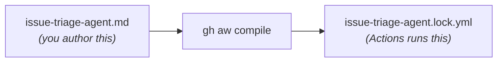

## Overview

GitHub recently launched [Agentic Workflows](https://github.blog/ai-and-ml/automate-repository-tasks-with-github-agentic-workflows/) - a new way to automate repository tasks using AI coding agents, written entirely in **Markdown**. Instead of writing complex YAML logic with dozens of conditional steps, you describe what you want in natural language, and a coding agent (like GitHub Copilot) interprets and executes those instructions at runtime.

GitHub calls this broader vision [Continuous AI](https://githubnext.com/projects/continuous-ai/) - integrating AI into the software development lifecycle (SDLC) the same way CI/CD integrated automated builds and deployments. Agentic workflows are how that works in practice.

I spent some time building a [demo repository](https://github.com/joshjohanning-org/agents-and-agentic-workflows) with 11 agentic workflows to kick the tires, and I wanted to share what I learned. including the gotchas I hit along the way. If you're thinking about trying agentic workflows, give this post a read to shorten your learning curve and avoid some common pitfalls.

> As of writing, GitHub Agentic Workflows is in **technical preview**. Features, syntax, and behavior may change.
{: .prompt-warning }

## What Are Agentic Workflows?

Traditional GitHub Actions workflows are **deterministic** - you define exact steps, and they run the same way every time. Agentic workflows are **adaptive** - you give an AI agent instructions in natural language, and it figures out what to do, which tools to call, and what output to produce.

Each agentic workflow is a Markdown file (`.md`) in `.github/workflows/` with two parts:

1. **YAML frontmatter** - triggers, permissions, tools, and safe outputs (the "what can the agent do" part)
2. **Markdown body** - natural language instructions for the agent (the "what should the agent do" part)

Here's a minimal example - an issue triage agent:

```markdown
---
on:
  issues:
    types: [opened, reopened]

permissions:
  contents: read
  issues: read

tools:
  github:
    toolsets: [issues, labels]
  bash: ["gh"]

safe-outputs:
  add-labels:
    allowed: [bug, feature, enhancement, documentation, question]
  add-comment: {}
---

# Issue Triage Agent

Analyze new issues in the repository. Read the title and body,
then add an appropriate label and leave a comment explaining
why the label was chosen.
```
{: file='.github/workflows/issue-triage-agent.md'}

That's it. No shell scripts. No `actions/github-script`. No 200 lines of YAML with [case functions](https://github.blog/changelog/2026-01-29-github-actions-smarter-editing-clearer-debugging-and-a-new-case-function/). The agent reads the issue, decides the right label, and explains its reasoning.

## How It Works

The `.md` file is not a GitHub Actions workflow by itself - it needs to be **compiled** into a `.lock.yml` file that Actions can run:



The compiled lock file is ~50-60 KB of generated YAML that handles:

- **Pre-activation** - Validates the actor has write access to the repo
- **Activation** - Checks secrets, builds the prompt, resolves runtime imports
- **Agent execution** - Runs the Copilot CLI in a sandboxed container with a network firewall
- **Safe outputs** - Processes the agent's requested write operations (comments, labels, PRs, issues)
- **Threat detection** - A second AI pass that validates the agent's output for safety
- **Conclusion** - Reports results and handles failures

### The Security Model

This was one of the parts I found most interesting. The security model is pretty solid - agentic workflows enforce **defense-in-depth**:

- **Read-only by default** - The GitHub MCP server runs with `GITHUB_READ_ONLY: "1"`. Agents cannot write to the repo directly.
- **Safe outputs** - All write operations (comments, labels, issues, PRs) go through a validated safe-output layer. You declare exactly what the agent is allowed to do in the frontmatter, and the runtime enforces it.
- **Sandboxed execution** - The agent runs inside Docker containers with network firewalling and domain allowlisting.
- **Tool allowlisting** - Only tools explicitly declared in the frontmatter are available to the agent.
- **Threat detection** - After the agent runs, a separate AI pass reviews its output for safety concerns.

## My Demo Repository

I built [11 agentic workflows](https://github.com/joshjohanning-org/agents-and-agentic-workflows) to get some hands-on experience. Here's what I ended up with:

### Core Workflows

| Workflow | Trigger | What It Does |
|---|---|---|
| **Issue Triage Agent** | Issue opened | Labels issues and leaves an explanatory comment |
| **Assign Issue to Copilot** | Issue opened | Evaluates if an issue is a good fit for Copilot and assigns it |
| **Daily Repo Status** | Scheduled (daily) | Creates a maintainer status report as a GitHub issue |
| **CI Doctor** | CI workflow failure | Investigates failures and opens a diagnostic issue |
| **Doc Sync** | PR merged | Checks if documentation needs updating after code changes |
| **Code Simplifier** | Scheduled (weekly) | Finds and proposes code simplifications via PR |
| **Test Improver** | Scheduled (weekly) | Identifies missing test coverage and adds tests via PR |
| **ChatOps Helper** | `/agent` in comments | Responds to slash commands in issue comments |

### Workflows with Custom Tools (Safe Inputs + MCP Servers)

These are where things get really interesting - instead of relying solely on the built-in GitHub tools, these workflows use **safe inputs** to define custom MCP tools inline and connect to **external MCP servers**, giving the agent capabilities beyond what standard Actions can do:

| Workflow | Dynamic Features | What It Does |
|---|---|---|
| **Release Notes Generator** | Safe inputs (JS + Shell) | Fetches commits, categorizes them, and generates structured release notes |
| **Security Monitor** | Safe inputs + DeepWiki MCP | Gathers security alerts and researches fixes via an external knowledge base |
| **Dependency Health Check** | Safe inputs (JS + Python) | Parses dependency files and checks registries for outdated packages |

## Extending Agent Capabilities

Beyond the built-in GitHub tools, there are two ways to give agents additional capabilities: **[safe inputs](#safe-inputs-custom-tools-inline)** (define custom tools inline) and **[external MCP servers](#external-mcp-servers)** (connect to existing services).

### Safe Inputs: Custom Tools Inline

This is probably the most powerful feature. Safe inputs let you define custom tools **right in the workflow** that the agent can call like any MCP tool. They run as isolated processes - you can write them in JavaScript, Python, Shell, or Go.

Here's an example from the dependency health check workflow:


```yaml
safe-inputs:
  check-npm-package-info:
    description: "Look up an npm package's latest version"
    inputs:
      package_name:
        type: string
        required: true
    script: |
      try {
        const resp = await fetch(
          `https://registry.npmjs.org/${encodeURIComponent(package_name)}/latest`
        );
        if (!resp.ok) return { error: `Package not found: ${package_name}` };
        const data = await resp.json();
        return {
          name: data.name,
          latest_version: data.version,
          deprecated: data.deprecated || false
        };
      } catch (e) {
        return { error: e.message };
      }
```
{: file='.github/workflows/dependency-health-check.md'}


The agent decides *when* to call this tool and *which packages* to look up based on its analysis of the PR. You can mix languages in the same workflow - the dependency health check uses JavaScript for npm lookups and Python for PyPI lookups.

> When using safe-inputs that make network calls, you need to explicitly allowlist the domains in the `network` section of the frontmatter. For example: `network: { allowed: [defaults, registry.npmjs.org, pypi.org] }`
{: .prompt-info }

### External MCP Servers

You can also connect agentic workflows to external MCP servers. The security monitor workflow connects to [DeepWiki](https://mcp.deepwiki.com) to research vulnerability fixes:

```yaml
mcp-servers:
  deepwiki:
    url: "https://mcp.deepwiki.com/sse"
    allowed:
      - read_wiki_structure
      - read_wiki_contents
      - ask_question

network:
  allowed:
    - defaults
    - mcp.deepwiki.com
```
{: file='.github/workflows/security-monitor.md'}

The agent gathers security alerts using safe-input tools, then uses DeepWiki to research remediation steps for critical vulnerabilities. You'd never be able to do this with regular `if/then` YAML.

> The possibilities are truly endless - you could integrate with Jira, Azure Boards, ServiceNow, or any service that exposes an MCP endpoint, as long as you have the appropriate authentication token configured as a repository secret.
{: .prompt-tip }

## Assigning Issues to the Copilot Coding Agent

One of the workflows I built assigns issues to the Copilot coding agent. This uses the `assign-to-agent` safe-output:

```yaml
safe-outputs:
  add-comment: {}
  assign-to-agent: {}
```
{: file='.github/workflows/assign-issue-to-copilot.md'}

The agent reads the issue, decides if it's a good candidate for Copilot (well-defined scope, low risk, code-focused), and if so, assigns it and leaves a comment explaining why. I think this is a fun pattern - one AI triaging work for another AI.

> The `assign-to-agent` safe-output requires a dedicated `GH_AW_AGENT_TOKEN` secret - a fine-grained PAT with **Issues: Read and write** permission. The default `GITHUB_TOKEN` doesn't have sufficient permissions for this. More on this in the [troubleshooting section](#troubleshooting-and-lessons-learned).
{: .prompt-warning }

## Setting Up Agentic Workflows

### Prerequisites

- [GitHub CLI](https://cli.github.com/) (`gh`) v2.0.0+
- The `gh-aw` CLI extension (`gh extension install github/gh-aw`)
- A `COPILOT_GITHUB_TOKEN` repository secret - a fine-grained personal access token (PAT) from a user account with Copilot access. The token needs **Account > Copilot Requests: Read-only** permission with **Public repositories** access (see [Secrets](#secrets) below).
- GitHub Actions enabled on the repository

### Installation

```bash
# Install the gh-aw CLI extension
gh extension install github/gh-aw

# Verify installation
gh aw version
```
{: .nolineno}

### Creating Your First Workflow

You can either write a workflow from scratch or add one from the [workflow gallery](https://github.github.com/gh-aw/blog/2026-01-12-welcome-to-pelis-agent-factory/). For example, this is how I added the daily repo status workflow:

```bash
gh aw add-wizard githubnext/agentics/daily-repo-status
```
{: .nolineno}

The wizard walks you through an interactive process to verify prerequisites, select an AI engine (Copilot, Claude, or Codex), set up the required secret, and create a pull request with the agentic workflow and generated lock file. See the [quick-start guide](https://github.github.com/gh-aw/setup/quick-start/) for a video walkthrough.

There's also a third option that [Colin Dembovsky covers well](https://colinsalmcorner.com/transform-sdlc-with-agentic-workflows/): you can bootstrap agentic workflows in a repo and then use the Copilot coding agent itself to *create new agentic workflows for you* via natural language prompts. The bootstrap process creates a custom agent file at `.github/agents/agentic-workflows.agent.md` that teaches Copilot how to author and refine workflows. It's a bit meta - using an agent to generate agents - but it works surprisingly well and means you never have to hand-edit frontmatter or YAML if you don't want to.

### Compilation

This is an important step that's easy to miss. The `.md` files are **not** GitHub Actions workflows - you have to compile them:

```bash
gh aw compile
```
{: .nolineno}

This generates a `.lock.yml` file for each `.md` workflow. Both the `.md` and `.lock.yml` files must be committed and pushed for the workflow to run.

> Pay attention to the compiler output! Warnings about missing permissions or invalid properties are easy to dismiss, but they often point to issues that will cause runtime failures. See the [troubleshooting section](#troubleshooting-and-lessons-learned) for examples.
{: .prompt-warning }

> Every time you change the frontmatter of an `.md` workflow file, you need to recompile with `gh aw compile`. Changes to just the Markdown body (the agent instructions) don't always require recompilation since the lock file uses runtime imports to read the `.md` at execution time - but it's safest to always recompile after changes.
{: .prompt-tip }

### Secrets

As mentioned, at a minimum you need `COPILOT_GITHUB_TOKEN` for agentic workflows to function. For my demo, I have three secrets configured:

| Secret | Purpose |
|---|---|
| `COPILOT_GITHUB_TOKEN` | Required for the Copilot engine to authenticate for agentic workflows |
| `GH_AW_AGENT_TOKEN` | Required for my `assign-to-agent` safe-output (fine-grained PAT with Issues write) |
| `GH_AW_SECURITY_ALERTS_TOKEN` | Required for my security monitor workflow (fine-grained PAT with read-only access to Dependabot alerts, code scanning alerts, and secret scanning alerts) |

The `COPILOT_GITHUB_TOKEN` is the most important one. Without it, the activation step will fail immediately.

{: .shadow }{: .light }
{: .shadow }{: .dark }
_Fine-grained PAT with Account > Copilot Requests: Read-only permission and Public repositories access_

## Troubleshooting and Lessons Learned

Here's every issue I ran into while building this demo, roughly in the order I hit them. Hopefully this saves you some time.

### 1. No Workflows Appear in the Actions Tab

**Symptom**: You pushed your `.md` workflow files but the Actions tab is empty.

**Cause**: GitHub Actions only recognizes `.yml`/`.yaml` files. The `.md` files need to be compiled into `.lock.yml` files first.

**Fix**:

```bash
gh aw compile
git add .github/workflows/*.lock.yml
git commit -m "feat: compile agentic workflows"
git push
```
{: .nolineno}

### 2. Invalid Frontmatter Properties

**Symptom**: Compilation fails with errors like:

```text
error: at '/safe-outputs/create-pull-request' (line X, column Y): Unknown property: branch-prefix
```
{: .nolineno}

**Cause**: The frontmatter schema is strict. Properties that seem reasonable (like `branch-prefix` under `create-pull-request`) may not exist.

**Fix**: Remove the invalid property. The compiler error message tells you exactly which property is invalid. Check the [frontmatter reference](https://github.github.com/gh-aw/reference/frontmatter/) for the full list of valid fields.

### 3. Missing Permissions Warnings

**Symptom**: Compilation succeeds but shows warnings like:

```text
warning: missing permission: issues: read (for safe-outputs.create-issue)
```
{: .nolineno}

**Cause**: The compiler infers which permissions are needed based on your frontmatter configuration. If you're using `safe-outputs` like `create-issue` or `add-labels`, you need the corresponding read permissions.

**Fix**: Add the missing permissions to your frontmatter:

```yaml
permissions:
  contents: read
  issues: read
  pull-requests: read
```
{: file='.github/workflows/your-workflow.md'}

### 4. Runtime Import File Not Found

**Symptom**: The workflow triggers and the `pre_activation` job succeeds, but the `activation` job fails with:

```text
ERR_API: Failed to process runtime import for .github/workflows/issue-triage-agent.md:
ERR_SYSTEM: Runtime import file not found: workflows/issue-triage-agent.md
```
{: .nolineno}

**Cause**: This was the trickiest one I hit. The compiled lock file uses `{{#runtime-import .github/workflows/your-workflow.md}}` to read the Markdown instructions at runtime. This requires the activation job to have a checkout step called "Checkout .github and .agents folders." If `contents: read` is missing from the permissions, the compiler **omits that checkout step entirely**, and the runtime import fails because the file isn't on disk.

**Fix**: Ensure your frontmatter includes `contents: read`:

```yaml
permissions:
  contents: read  # Required for runtime imports!
  issues: read
```
{: file='.github/workflows/your-workflow.md'}

Then recompile:

```bash
gh aw compile
```
{: .nolineno}

You can verify the fix by checking that the compiled lock file contains the "Checkout .github and .agents folders" step:

```bash
grep -c 'Checkout .github and .agents' .github/workflows/your-workflow.lock.yml
# Should output: 1
```
{: .nolineno}

> This was a subtle bug because the compiler doesn't warn about it, and the error message doesn't mention permissions. The inner error says "file not found" even though the file exists in the repo - it just wasn't checked out.
{: .prompt-warning }

### 5. COPILOT_GITHUB_TOKEN Secret Not Set

**Symptom**: The activation job fails at the "Validate COPILOT_GITHUB_TOKEN secret" step.

**Fix**: Add the `COPILOT_GITHUB_TOKEN` secret to your repository:

```bash
gh secret set COPILOT_GITHUB_TOKEN -R owner/repo
```
{: .nolineno}

### 6. Stale Lock Files After Frontmatter Changes

**Symptom**: You added a new `safe-output` (like `assign-to-agent`) to the frontmatter, but the compiled lock file doesn't include the corresponding handler or job step.

**Cause**: The lock file from a previous compilation doesn't reflect your frontmatter changes.

**Fix**: Always recompile after frontmatter changes:

```bash
gh aw compile
```
{: .nolineno}

Then verify the handler config includes your new safe-output:

```bash
grep 'HANDLER_CONFIG' .github/workflows/your-workflow.lock.yml
```
{: .nolineno}

### 7. assign-to-agent Fails with Insufficient Permissions

**Symptom**: The workflow runs successfully, the agent decides to assign the issue, but the `safe_outputs` job reports:

```text
Agent Assignment Failed: Failed to assign agent to issues due to
insufficient permissions or missing token.
```
{: .nolineno}

**Cause**: The `assign-to-agent` step uses `secrets.GH_AW_AGENT_TOKEN` (falling back to `secrets.GH_AW_GITHUB_TOKEN`, then `secrets.GITHUB_TOKEN`). The default `GITHUB_TOKEN` does not have sufficient permissions to assign the Copilot coding agent.

**Fix**: Create a fine-grained PAT with **Issues: Read and write** permission and add it as a secret:

```bash
gh secret set GH_AW_AGENT_TOKEN -R owner/repo
```
{: .nolineno}

I ran into a similar issue with my security monitor workflow - the default `GITHUB_TOKEN` doesn't have access to the security alerts APIs either. I created another fine-grained PAT with read-only access to **Dependabot alerts**, **Code scanning alerts**, and **Secret scanning alerts** and added it as `GH_AW_SECURITY_ALERTS_TOKEN`.

### 8. Can't Re-run a Failed Workflow After Changing the Lock File

**Symptom**: A workflow failed, you fixed the issue and recompiled, but GitHub won't let you re-run the failed run.

**Cause**: GitHub Actions re-runs use the workflow definition from the original run. If the lock file changed, you can't re-run - you need a fresh trigger.

**Fix**: Create a new trigger event. For issue-triggered workflows, close and reopen the issue:

```bash
gh issue close 1 -R owner/repo && gh issue reopen 1 -R owner/repo
```
{: .nolineno}

### 9. workflow_run Trigger Should Include Branch Restrictions

**Symptom**: Compilation succeeds but with a warning:

```text
warning: workflow_run trigger should include branch restrictions
for security and performance.
```
{: .nolineno}

**Cause**: Without branch restrictions, the workflow triggers for workflow runs on *all* branches.

**Fix**: This is just a warning and doesn't prevent the workflow from running. You can add branch restrictions to the `workflow_run` trigger if desired, but for a demo repo it's fine to ignore.

### 10. Valid Safe-Output Names

**Symptom**: Compilation fails with:

```text
error: Unknown property: assign-to-copilot. Valid fields are: activation-comments,
add-comment, add-labels, add-reviewer, allowed-domains, ...
```
{: .nolineno}

**Fix**: Use the exact safe-output names from the error message. The valid ones include: `add-comment`, `add-labels`, `add-reviewer`, `assign-to-agent`, `assign-to-user`, `assign-milestone`, `create-issue`, `create-pull-request`, and others. The compiler error helpfully lists all valid options.

## What I Liked

After getting past the setup hurdles, a few things stood out:

- **The authoring experience** - Writing natural language instructions in Markdown is way simpler than writing complex YAML workflows. The frontmatter handles the "infrastructure" (triggers, permissions, tools), and the Markdown handles the "logic."
- **Safe inputs** - Being able to define custom MCP tools inline - mixing JavaScript, Python, and Shell in the same workflow - gives agents real capabilities without compromising security. The agent decides when and how to use them.
- **The security model** - Read-only by default, safe outputs for writes, sandboxed execution, network firewalls, and threat detection. This is not a "give the AI root access" situation.
- **The compilation model** - The `.md` file is the source of truth for humans, and the `.lock.yml` is the source of truth for Actions. The lock file handles all the infrastructure (Docker containers, MCP gateway, firewall rules, secret management) so the author only thinks about intent.
- **Chaining AI** - Having an agentic workflow that triages issues and then assigns them to the Copilot coding agent is a fun pattern - one AI deciding what another AI should work on.

## Tips for Getting Started

- **Start with a simple workflow** like issue triage or daily status. Get the compile-push-trigger cycle working before adding safe-inputs or MCP servers.
- **Always include `contents: read`** in your permissions. Several features depend on it, and the failure mode is non-obvious.
- **Recompile after every frontmatter change.** Markdown body changes are picked up at runtime, but frontmatter changes require recompilation.
- **Check the lock file diff** after compiling. It's generated code, but scanning it for expected handler configs and job steps can catch issues early.
- **Use the `gh aw` CLI** liberally. `gh aw compile` validates your frontmatter and catches errors before you push.
- **Set up the `COPILOT_GITHUB_TOKEN` secret first.** Everything else depends on it.
- **Be aware of costs.** Each workflow run typically incurs two [Copilot premium requests](https://docs.github.com/en/billing/concepts/product-billing/github-copilot-premium-requests) - one for the agentic work and one for the guardrail check through safe outputs - plus GitHub Actions runner minutes. Monitor your usage to avoid surprises.
- **Outputs are traceable.** Issues and PRs created by agentic workflows include hidden HTML metadata with the workflow ID and run URL. You can search for the workflow ID in your repo to find all issues, PRs, and code references tied to a specific workflow.

## Resources

- [GitHub Blog: Automate repository tasks with GitHub Agentic Workflows](https://github.blog/ai-and-ml/automate-repository-tasks-with-github-agentic-workflows/)
- [Agentic Workflows Documentation](https://github.github.com/gh-aw/)
- [Quick Start Guide](https://github.github.com/gh-aw/setup/quick-start/)
- [Frontmatter Reference](https://github.github.com/gh-aw/reference/frontmatter/)
- [Safe Inputs Reference](https://github.github.com/gh-aw/reference/safe-inputs/)
- [Using MCP Servers](https://github.github.com/gh-aw/guides/mcps/)
- [Creating Workflows](https://github.github.com/gh-aw/setup/creating-workflows/)
- [Continuous AI - GitHub Next](https://githubnext.com/projects/continuous-ai/)
- [Peli's Agent Factory - Workflow Gallery](https://github.github.com/gh-aw/blog/2026-01-12-welcome-to-pelis-agent-factory/)
- [Colin Dembovsky: Transform Your SDLC with Agentic Workflows](https://colinsalmcorner.com/transform-sdlc-with-agentic-workflows/)
- [My Demo Repository](https://github.com/joshjohanning-org/agents-and-agentic-workflows)

## Summary

GitHub Agentic Workflows are a really interesting take on repository automation. Writing natural language instructions that an AI agent executes - with real tools, real security constraints, and real GitHub operations - lets you do things that just aren't possible with deterministic YAML.

The tooling is still in technical preview and has some rough edges (as my troubleshooting list shows), but I'm excited about where this is heading. If you want to try it out, I'd start with a simple triage or reporting workflow and build from there. Check out my [demo repository](https://github.com/joshjohanning-org/agents-and-agentic-workflows) for working examples of all the patterns I covered here. Happy automating! 🚀
